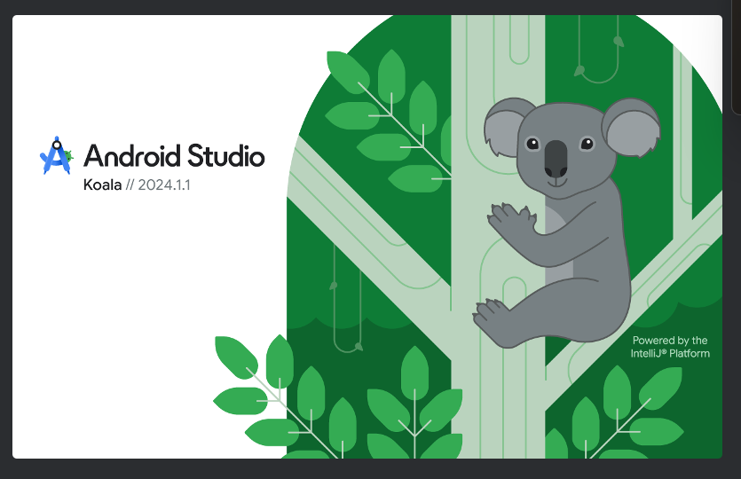
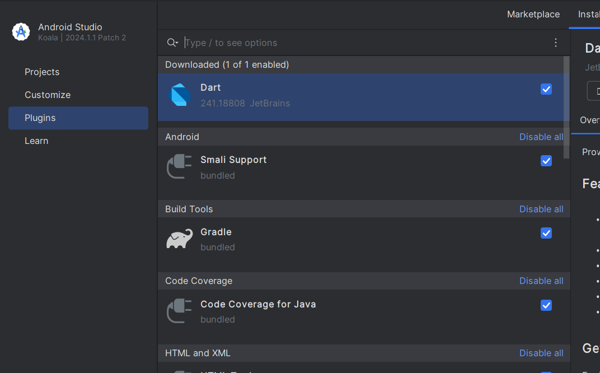
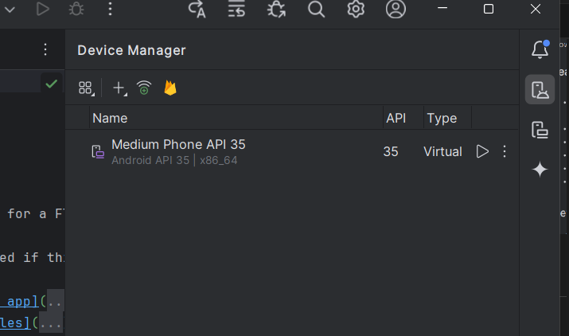

# Prodesk Mobile App

## Prequerisities
1. Android Studio



> We use Android Studio Koala version for working on this project

## Installation
**1. Cloning Repo**

```bash
git clone
```

**2. Installing Android Studio**

Follow the installation process

> Make sure to install all basic plugin before running the project



## Running Project

**1. Open repo directory on Android Studio**

Open repo directory and wait **Gradle** sync process
> If sync process not showing, you can click on sync button in right corner of Android Studio.

**2. Set Up Emulator**

You can add emulator by clicking **Device Manager** on right side panel of Android Studio



**3. Running The Project**

After you had done with all depedencies above, now you can run and develop Prodesk Mobile App